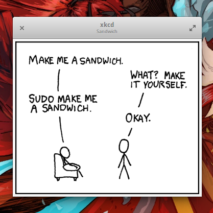

xkcd
====

Simple Vala application to display the latest xkcd (http://www.xkcd.com/) comic.

Using the Granite Framework (https://launchpad.net/granite)

* compile:
make

* run:
./xkcd

* install:
sudo make install

* uninstall:
sudo make uninstall
